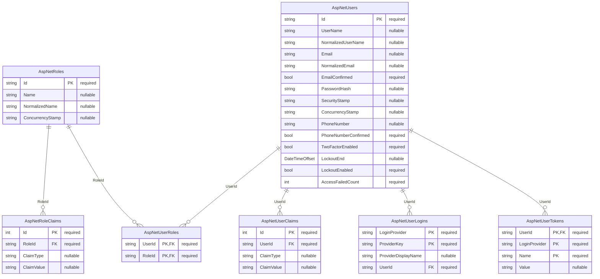

# ConnectX Database Structure

Generated from the EF Core migration files for the two database contexts in this solution:

- `ConnectX.Web` Identity database: `src/WebServices/ConnectX.Web/Data/Migrations/20260523153424_InitialIdentitySchema.cs`
- `ConnectX.Api` domain database: `src/ApiServices/ConnectX.Api.Ef/Migrations/20260523193657_InitialEntitiesConfiguration.cs`

Each Mermaid entity lists the table columns. `PK` marks primary key columns, `FK` marks foreign key columns, and the quoted suffix indicates whether the column is nullable in the migration.

### ConnectX.Web Identity Database



### ConnectX.Api Domain Database

```mermaid
erDiagram
    AcademicLocations {
        Guid Id PK "required"
        Guid ExternalId "required"
        string Code "required"
        string Name "required"
        int LocationType "required"
        string Description "nullable"
        string AddressLine1 "nullable"
        string AddressLine2 "nullable"
        string City "nullable"
        string PostalCode "nullable"
        string Country "nullable"
        string RoomNumber "nullable"
        string BuildingName "nullable"
        string ReceptionPhoneNumber "nullable"
        string MapUrl "nullable"
        decimal Latitude "nullable"
        decimal Longitude "nullable"
        bool IsAccessible "required"
        bool IsActive "required"
        DateTime CreatedDate "required"
        DateTime UpdatedDate "required"
        bool IsDeleted "required"
        DateTime DeletedDate "nullable"
    }

    AcademicQuestionReplies {
        Guid Id PK "required"
        Guid ExternalId "required"
        Guid AcademicQuestionId FK "required"
        Guid AuthorId "required"
        int AuthorRole "required"
        string Body "required"
        DateTimeOffset PostedAt "required"
        bool IsAcceptedAnswer "required"
        DateTime CreatedDate "required"
        DateTime UpdatedDate "required"
        bool IsDeleted "required"
        DateTime DeletedDate "nullable"
    }

    AcademicQuestions {
        Guid Id PK "required"
        Guid ExternalId "required"
        Guid StudentId "required"
        Guid ModuleOfferingId FK "required"
        Guid AssignmentId FK "nullable"
        Guid PracticeExerciseId FK "nullable"
        string Title "required"
        string Body "required"
        int Status "required"
        DateTimeOffset AskedAt "required"
        DateTimeOffset ResolvedAt "nullable"
        Guid AcceptedAnswerId FK "nullable"
        DateTime CreatedDate "required"
        DateTime UpdatedDate "required"
        bool IsDeleted "required"
        DateTime DeletedDate "nullable"
    }

    Announcements {
        Guid Id PK "required"
        Guid ExternalId "required"
        Guid ModuleOfferingId FK "required"
        Guid TeacherId FK "nullable"
        string Title "required"
        string Body "required"
        int Audience "required"
        int Priority "required"
        DateTimeOffset PublishedAt "required"
        DateTimeOffset ExpiresAt "nullable"
        bool IsPinned "required"
        DateTime CreatedDate "required"
        DateTime UpdatedDate "required"
        bool IsDeleted "required"
        DateTime DeletedDate "nullable"
    }

    Assignments {
        Guid Id PK "required"
        Guid ExternalId "required"
        Guid ProgramModuleId FK "required"
        Guid MeetingId FK "nullable"
        string Title "required"
        string Instructions "nullable"
        int AssignmentType "required"
        int Status "required"
        DateTimeOffset AvailableFrom "nullable"
        DateTimeOffset DueAt "nullable"
        decimal MaximumScore "nullable"
        decimal WeightPercentage "nullable"
        bool IsPreparationRequired "required"
        bool AllowsResubmission "required"
        string RubricUrl "nullable"
        DateTime CreatedDate "required"
        DateTime UpdatedDate "required"
        bool IsDeleted "required"
        DateTime DeletedDate "nullable"
    }

    AssignmentSubmissions {
        Guid Id PK "required"
        Guid ExternalId "required"
        Guid StudentId "required"
        Guid AssignmentId FK "required"
        Guid GradedByTeacherId FK "nullable"
        int AttemptNumber "required"
        int Status "required"
        DateTimeOffset SubmittedAt "nullable"
        string SubmissionText "nullable"
        string FileUrl "nullable"
        decimal Score "nullable"
        string Grade "nullable"
        string Feedback "nullable"
        DateTimeOffset GradedAt "nullable"
        DateTime CreatedDate "required"
        DateTime UpdatedDate "required"
        bool IsDeleted "required"
        DateTime DeletedDate "nullable"
    }

    AttendanceRecords {
        Guid Id PK "required"
        Guid ExternalId "required"
        Guid StudentId "required"
        Guid MeetingId FK "required"
        int Status "required"
        DateTimeOffset CheckedInAt "nullable"
        DateTimeOffset CheckedOutAt "nullable"
        string Notes "nullable"
        DateTime CreatedDate "required"
        DateTime UpdatedDate "required"
        bool IsDeleted "required"
        DateTime DeletedDate "nullable"
    }

    BibliographicReferences {
        Guid Id PK "required"
        Guid ExternalId "required"
        Guid ProgramModuleId FK "required"
        Guid MeetingId FK "nullable"
        int ReferenceType "required"
        string Title "required"
        string Authors "nullable"
        string Editor "nullable"
        string Publisher "nullable"
        string JournalName "nullable"
        string Edition "nullable"
        string Volume "nullable"
        string Issue "nullable"
        string PageRange "nullable"
        int PublicationYear "nullable"
        string Isbn "nullable"
        string Issn "nullable"
        string Doi "nullable"
        string Url "nullable"
        string CitationText "nullable"
        bool IsRequiredReading "required"
        int SortOrder "required"
        DateTime CreatedDate "required"
        DateTime UpdatedDate "required"
        bool IsDeleted "required"
        DateTime DeletedDate "nullable"
    }

    Cohorts {
        Guid Id PK "required"
        Guid ExternalId "required"
        Guid StudyProgramId FK "required"
        string Name "required"
        string AcademicYear "required"
        DateOnly StartsOn "required"
        DateOnly EndsOn "nullable"
        string Location "nullable"
        int DeliveryMode "required"
        int Capacity "nullable"
        DateTime CreatedDate "required"
        DateTime UpdatedDate "required"
        bool IsDeleted "required"
        DateTime DeletedDate "nullable"
    }

    DiscussionPosts {
        Guid Id PK "required"
        Guid ExternalId "required"
        Guid DiscussionTopicId FK "required"
        Guid ParentPostId FK "nullable"
        Guid AuthorId "required"
        int AuthorRole "required"
        string Body "required"
        DateTimeOffset PostedAt "required"
        DateTimeOffset EditedAt "nullable"
        bool IsInstructorEndorsed "required"
        DateTime CreatedDate "required"
        DateTime UpdatedDate "required"
        bool IsDeleted "required"
        DateTime DeletedDate "nullable"
    }

    DiscussionTopics {
        Guid Id PK "required"
        Guid ExternalId "required"
        Guid ModuleOfferingId FK "required"
        Guid MeetingId FK "nullable"
        Guid CreatedById "required"
        int CreatedByRole "required"
        string Title "required"
        string Prompt "nullable"
        int Audience "required"
        int Status "required"
        bool IsPinned "required"
        DateTimeOffset OpenedAt "required"
        DateTimeOffset ClosedAt "nullable"
        DateTime CreatedDate "required"
        DateTime UpdatedDate "required"
        bool IsDeleted "required"
        DateTime DeletedDate "nullable"
    }

    DownloadDocuments {
        Guid Id PK "required"
        Guid ExternalId "required"
        Guid StudyProgramId FK "nullable"
        Guid ProgramModuleId FK "nullable"
        Guid PublishedByTeacherId FK "nullable"
        string Title "required"
        string Description "nullable"
        int DocumentType "required"
        string FileName "required"
        string FileUrl "required"
        string Version "nullable"
        DateTimeOffset PublishedAt "required"
        DateTimeOffset ExpiresAt "nullable"
        bool IsMandatory "required"
        DateTime CreatedDate "required"
        DateTime UpdatedDate "required"
        bool IsDeleted "required"
        DateTime DeletedDate "nullable"
    }

    ExamResults {
        Guid Id PK "required"
        Guid ExternalId "required"
        Guid StudentId "required"
        Guid ExamId FK "required"
        int AttemptNumber "required"
        decimal Score "nullable"
        string Grade "nullable"
        bool Passed "required"
        DateTimeOffset RecordedAt "required"
        DateTimeOffset PublishedAt "nullable"
        string Feedback "nullable"
        DateTime CreatedDate "required"
        DateTime UpdatedDate "required"
        bool IsDeleted "required"
        DateTime DeletedDate "nullable"
    }

    Exams {
        Guid Id PK "required"
        Guid ExternalId "required"
        Guid ProgramModuleId FK "required"
        string Title "required"
        int AssessmentType "required"
        DateTimeOffset ScheduledAt "nullable"
        int DurationMinutes "nullable"
        string Location "nullable"
        string OnlineExamUrl "nullable"
        DateTimeOffset RegistrationDeadline "nullable"
        decimal WeightPercentage "nullable"
        decimal PassingScore "nullable"
        string Instructions "nullable"
        DateTimeOffset ResultsPublishedAt "nullable"
        DateTime CreatedDate "required"
        DateTime UpdatedDate "required"
        bool IsDeleted "required"
        DateTime DeletedDate "nullable"
    }

    ExamTrainingPracticeExercises {
        Guid ExamTrainingId PK,FK "required"
        Guid PracticeExerciseId PK,FK "required"
    }

    ExamTrainingPracticeTests {
        Guid ExamTrainingId PK,FK "required"
        Guid OnlineTestId PK,FK "required"
    }

    ExamTrainings {
        Guid Id PK "required"
        Guid ExternalId "required"
        Guid ProgramModuleId FK "required"
        string Title "required"
        string Description "nullable"
        DateTimeOffset OpensAt "nullable"
        DateTimeOffset ClosesAt "nullable"
        int TimeLimitMinutes "nullable"
        decimal PassingScore "nullable"
        bool IsOptional "required"
        DateTime CreatedDate "required"
        DateTime UpdatedDate "required"
        bool IsDeleted "required"
        DateTime DeletedDate "nullable"
    }

    InteractiveApplications {
        Guid Id PK "required"
        Guid ExternalId "required"
        Guid ProgramModuleId FK "required"
        Guid MeetingId FK "nullable"
        string Name "required"
        string Description "nullable"
        string LaunchUrl "required"
        string ProviderName "nullable"
        bool OpensInNewWindow "required"
        bool RequiresAuthentication "required"
        bool TracksProgress "required"
        DateTime CreatedDate "required"
        DateTime UpdatedDate "required"
        bool IsDeleted "required"
        DateTime DeletedDate "nullable"
    }

    LearningActivities {
        Guid Id PK "required"
        Guid ExternalId "required"
        Guid MeetingId FK "required"
        string Title "required"
        string Description "nullable"
        int ActivityType "required"
        int SortOrder "required"
        int DurationMinutes "nullable"
        string Instructions "nullable"
        bool IsRequired "required"
        DateTime CreatedDate "required"
        DateTime UpdatedDate "required"
        bool IsDeleted "required"
        DateTime DeletedDate "nullable"
    }

    LearningObjectives {
        Guid Id PK "required"
        Guid ExternalId "required"
        Guid ProgramModuleId FK "required"
        Guid MeetingId FK "nullable"
        string Title "required"
        string Description "required"
        int SortOrder "required"
        string BloomLevel "nullable"
        bool IsAssessed "required"
        DateTime CreatedDate "required"
        DateTime UpdatedDate "required"
        bool IsDeleted "required"
        DateTime DeletedDate "nullable"
    }

    LearningResources {
        Guid Id PK "required"
        Guid ExternalId "required"
        Guid ProgramModuleId FK "required"
        Guid MeetingId FK "nullable"
        Guid PublishedByTeacherId FK "nullable"
        Guid BibliographicReferenceId FK "nullable"
        string Title "required"
        string Description "nullable"
        int ResourceType "required"
        int Visibility "required"
        string Url "nullable"
        string FileName "nullable"
        int SortOrder "required"
        bool IsRequired "required"
        DateTimeOffset PublishedAt "nullable"
        DateTime CreatedDate "required"
        DateTime UpdatedDate "required"
        bool IsDeleted "required"
        DateTime DeletedDate "nullable"
    }

    LessonContents {
        Guid Id PK "required"
        Guid ExternalId "required"
        Guid ProgramModuleId FK "required"
        Guid MeetingId FK "nullable"
        Guid PublishedByTeacherId FK "nullable"
        string Title "required"
        string Summary "nullable"
        string Body "nullable"
        int SortOrder "required"
        int EstimatedStudyMinutes "nullable"
        DateTimeOffset AvailableFrom "nullable"
        DateTimeOffset PublishedAt "nullable"
        int Visibility "required"
        bool IsRequired "required"
        DateTime CreatedDate "required"
        DateTime UpdatedDate "required"
        bool IsDeleted "required"
        DateTime DeletedDate "nullable"
    }

    LocationDirections {
        Guid Id PK "required"
        Guid ExternalId "required"
        Guid AcademicLocationId FK "required"
        int TravelMode "required"
        string Title "required"
        string Instructions "required"
        string PublicTransportStop "nullable"
        string ParkingInstructions "nullable"
        string AccessibilityNotes "nullable"
        string ExternalNavigationUrl "nullable"
        int SortOrder "required"
        DateTime CreatedDate "required"
        DateTime UpdatedDate "required"
        bool IsDeleted "required"
        DateTime DeletedDate "nullable"
    }

    Meetings {
        Guid Id PK "required"
        Guid ExternalId "required"
        Guid ModuleOfferingId FK "required"
        Guid AcademicLocationId FK "nullable"
        int SequenceNumber "required"
        string Title "required"
        string Description "nullable"
        DateTimeOffset StartsAt "required"
        DateTimeOffset EndsAt "required"
        int Format "required"
        string Location "nullable"
        string OnlineMeetingUrl "nullable"
        string PreparationInstructions "nullable"
        string CancellationReason "nullable"
        bool IsCancelled "required"
        DateTime CreatedDate "required"
        DateTime UpdatedDate "required"
        bool IsDeleted "required"
        DateTime DeletedDate "nullable"
    }

    ModuleEnrollments {
        Guid Id PK "required"
        Guid ExternalId "required"
        Guid StudentId "required"
        Guid ModuleOfferingId FK "required"
        int Status "required"
        DateOnly EnrolledOn "required"
        DateOnly CompletedOn "nullable"
        decimal FinalGrade "nullable"
        decimal AttendancePercentage "nullable"
        string CompletionRemarks "nullable"
        DateTime CreatedDate "required"
        DateTime UpdatedDate "required"
        bool IsDeleted "required"
        DateTime DeletedDate "nullable"
    }

    ModuleOfferings {
        Guid Id PK "required"
        Guid ExternalId "required"
        Guid ProgramModuleId FK "required"
        Guid CohortId FK "nullable"
        Guid TeacherId FK "nullable"
        Guid AcademicLocationId FK "nullable"
        string AcademicYear "required"
        string Term "required"
        int DeliveryMode "required"
        DateOnly StartsOn "required"
        DateOnly EndsOn "nullable"
        string Location "nullable"
        string OnlineClassroomUrl "nullable"
        int MaximumParticipants "nullable"
        DateTime CreatedDate "required"
        DateTime UpdatedDate "required"
        bool IsDeleted "required"
        DateTime DeletedDate "nullable"
    }

    OnlineTests {
        Guid Id PK "required"
        Guid ExternalId "required"
        Guid ProgramModuleId FK "required"
        Guid MeetingId FK "nullable"
        string Title "required"
        string Instructions "nullable"
        bool IsPracticeTest "required"
        DateTimeOffset OpensAt "nullable"
        DateTimeOffset ClosesAt "nullable"
        int TimeLimitMinutes "nullable"
        int AttemptLimit "nullable"
        decimal PassingScore "nullable"
        DateTime CreatedDate "required"
        DateTime UpdatedDate "required"
        bool IsDeleted "required"
        DateTime DeletedDate "nullable"
    }

    PersonalDetailChangeRequests {
        Guid Id PK "required"
        Guid ExternalId "required"
        Guid StudentId "required"
        Guid StudentPersonalFileId FK "nullable"
        string FieldName "required"
        string CurrentValue "nullable"
        string RequestedValue "nullable"
        string Reason "nullable"
        int Status "required"
        DateTimeOffset SubmittedAt "required"
        DateTimeOffset ReviewedAt "nullable"
        Guid ReviewedByStaffId "nullable"
        string ReviewerNotes "nullable"
        DateTime CreatedDate "required"
        DateTime UpdatedDate "required"
        bool IsDeleted "required"
        DateTime DeletedDate "nullable"
    }

    PlatformAccessLogs {
        Guid Id PK "required"
        Guid ExternalId "required"
        Guid StudentId "required"
        DateTimeOffset AccessedAt "required"
        int DeviceType "required"
        string DeviceName "nullable"
        string BrowserName "nullable"
        string OperatingSystem "nullable"
        string IpAddress "nullable"
        string Country "nullable"
        bool WasSuccessful "required"
        string FailureReason "nullable"
        DateTime CreatedDate "required"
        DateTime UpdatedDate "required"
        bool IsDeleted "required"
        DateTime DeletedDate "nullable"
    }

    PracticeExercises {
        Guid Id PK "required"
        Guid ExternalId "required"
        Guid ProgramModuleId FK "required"
        Guid MeetingId FK "nullable"
        string Title "required"
        string Instructions "nullable"
        string DifficultyLevel "nullable"
        int EstimatedDurationMinutes "nullable"
        bool IsOptional "required"
        string ResourceUrl "nullable"
        string SolutionUrl "nullable"
        DateTime CreatedDate "required"
        DateTime UpdatedDate "required"
        bool IsDeleted "required"
        DateTime DeletedDate "nullable"
    }

    ProgramEnrollments {
        Guid Id PK "required"
        Guid ExternalId "required"
        Guid StudentId "required"
        Guid StudyProgramId FK "required"
        string StudentNumber "nullable"
        int Status "required"
        DateOnly EnrolledOn "required"
        DateOnly ExpectedCompletionOn "nullable"
        DateOnly CompletedOn "nullable"
        decimal ProgressPercentage "nullable"
        string AdvisorNotes "nullable"
        DateTime CreatedDate "required"
        DateTime UpdatedDate "required"
        bool IsDeleted "required"
        DateTime DeletedDate "nullable"
    }

    ProgramModules {
        Guid Id PK "required"
        Guid ExternalId "required"
        Guid StudyProgramId FK "required"
        Guid CoordinatorTeacherId FK "nullable"
        string Code "required"
        string Name "required"
        string Description "nullable"
        int SequenceNumber "required"
        decimal CreditValue "required"
        int EstimatedStudyHours "required"
        string Prerequisites "nullable"
        bool IsMandatory "required"
        DateTime CreatedDate "required"
        DateTime UpdatedDate "required"
        bool IsDeleted "required"
        DateTime DeletedDate "nullable"
    }

    StudentNotifications {
        Guid Id PK "required"
        Guid ExternalId "required"
        Guid StudentId "required"
        Guid ModuleOfferingId FK "nullable"
        string Title "required"
        string Body "required"
        int Priority "required"
        DateTimeOffset CreatedAt "required"
        DateTimeOffset ReadAt "nullable"
        string ActionUrl "nullable"
        DateTime CreatedDate "required"
        DateTime UpdatedDate "required"
        bool IsDeleted "required"
        DateTime DeletedDate "nullable"
    }

    StudentPersonalFiles {
        Guid Id PK "required"
        Guid ExternalId "required"
        Guid StudentId "required"
        string StudentNumber "required"
        string FirstName "required"
        string LastName "required"
        string Email "required"
        string PhoneNumber "nullable"
        DateOnly DateOfBirth "nullable"
        string AddressLine1 "nullable"
        string AddressLine2 "nullable"
        string City "nullable"
        string PostalCode "nullable"
        string Country "nullable"
        string EmergencyContactName "nullable"
        string EmergencyContactPhone "nullable"
        DateTimeOffset LastConfirmedAt "required"
        DateTime CreatedDate "required"
        DateTime UpdatedDate "required"
        bool IsDeleted "required"
        DateTime DeletedDate "nullable"
    }

    StudyPrograms {
        Guid Id PK "required"
        Guid ExternalId "required"
        string Code "required"
        string Name "required"
        string Description "nullable"
        int Level "required"
        string Language "required"
        decimal CreditValue "required"
        int NominalStudyHours "required"
        DateOnly StartsOn "nullable"
        DateOnly EndsOn "nullable"
        bool IsActive "required"
        DateTime CreatedDate "required"
        DateTime UpdatedDate "required"
        bool IsDeleted "required"
        DateTime DeletedDate "nullable"
    }

    StudyTips {
        Guid Id PK "required"
        Guid ExternalId "required"
        Guid ProgramModuleId FK "required"
        Guid MeetingId FK "nullable"
        Guid PublishedByTeacherId FK "nullable"
        string Title "required"
        string Body "required"
        int Category "required"
        int SortOrder "required"
        DateTimeOffset PublishedAt "nullable"
        bool IsHighlighted "required"
        DateTime CreatedDate "required"
        DateTime UpdatedDate "required"
        bool IsDeleted "required"
        DateTime DeletedDate "nullable"
    }

    SupplementaryMaterials {
        Guid Id PK "required"
        Guid ExternalId "required"
        Guid ProgramModuleId FK "required"
        Guid MeetingId FK "nullable"
        Guid PublishedByTeacherId FK "nullable"
        string Title "required"
        string Description "nullable"
        int ResourceType "required"
        string FileUrl "nullable"
        string ExternalUrl "nullable"
        DateTimeOffset PublishedAt "required"
        bool IsHighlighted "required"
        DateTime CreatedDate "required"
        DateTime UpdatedDate "required"
        bool IsDeleted "required"
        DateTime DeletedDate "nullable"
    }

    SupportMessages {
        Guid Id PK "required"
        Guid ExternalId "required"
        Guid SupportRequestId FK "required"
        Guid AuthorId "required"
        int AuthorRole "required"
        string Body "required"
        DateTimeOffset SentAt "required"
        bool IsInternalNote "required"
        DateTime CreatedDate "required"
        DateTime UpdatedDate "required"
        bool IsDeleted "required"
        DateTime DeletedDate "nullable"
    }

    SupportRequests {
        Guid Id PK "required"
        Guid ExternalId "required"
        Guid StudentId "required"
        Guid ProgramModuleId FK "nullable"
        Guid ModuleOfferingId FK "nullable"
        string ReferenceNumber "required"
        string Subject "required"
        string Description "required"
        int Category "required"
        int Status "required"
        int Priority "required"
        DateTimeOffset SubmittedAt "required"
        DateTimeOffset LastResponseAt "nullable"
        DateTimeOffset ResolvedAt "nullable"
        Guid AssignedStaffId "nullable"
        DateTime CreatedDate "required"
        DateTime UpdatedDate "required"
        bool IsDeleted "required"
        DateTime DeletedDate "nullable"
    }

    Teachers {
        Guid Id PK "required"
        Guid ExternalId "required"
        string StaffNumber "required"
        string FirstName "required"
        string LastName "required"
        string DisplayName "required"
        string Email "required"
        string PhoneNumber "nullable"
        string Biography "nullable"
        string ExpertiseArea "nullable"
        string OfficeLocation "nullable"
        string PreferredContactMethod "nullable"
        bool IsFreelance "required"
        bool IsActive "required"
        DateTime CreatedDate "required"
        DateTime UpdatedDate "required"
        bool IsDeleted "required"
        DateTime DeletedDate "nullable"
    }

    TestAnswers {
        Guid Id PK "required"
        Guid ExternalId "required"
        Guid TestAttemptId FK "required"
        Guid TestQuestionId FK "required"
        Guid SelectedOptionId FK "nullable"
        string ResponseText "nullable"
        bool IsCorrect "nullable"
        decimal PointsAwarded "nullable"
        DateTime CreatedDate "required"
        DateTime UpdatedDate "required"
        bool IsDeleted "required"
        DateTime DeletedDate "nullable"
    }

    TestAttempts {
        Guid Id PK "required"
        Guid ExternalId "required"
        Guid StudentId "required"
        Guid OnlineTestId FK "required"
        int AttemptNumber "required"
        DateTimeOffset StartedAt "required"
        DateTimeOffset SubmittedAt "nullable"
        decimal Score "nullable"
        bool Passed "nullable"
        DateTime CreatedDate "required"
        DateTime UpdatedDate "required"
        bool IsDeleted "required"
        DateTime DeletedDate "nullable"
    }

    TestOptions {
        Guid Id PK "required"
        Guid ExternalId "required"
        Guid TestQuestionId FK "required"
        string Text "required"
        int SortOrder "required"
        bool IsCorrect "required"
        string Feedback "nullable"
        DateTime CreatedDate "required"
        DateTime UpdatedDate "required"
        bool IsDeleted "required"
        DateTime DeletedDate "nullable"
    }

    TestQuestions {
        Guid Id PK "required"
        Guid ExternalId "required"
        Guid OnlineTestId FK "required"
        int QuestionType "required"
        string Prompt "required"
        string Explanation "nullable"
        int SortOrder "required"
        decimal Points "required"
        DateTime CreatedDate "required"
        DateTime UpdatedDate "required"
        bool IsDeleted "required"
        DateTime DeletedDate "nullable"
    }

    AcademicLocations ||--o{ LocationDirections : "AcademicLocationId"
    AcademicLocations ||--o{ Meetings : "AcademicLocationId"
    AcademicLocations ||--o{ ModuleOfferings : "AcademicLocationId"
    AcademicQuestionReplies ||--o{ AcademicQuestions : "AcceptedAnswerId"
    AcademicQuestions ||--o{ AcademicQuestionReplies : "AcademicQuestionId"
    Assignments ||--o{ AcademicQuestions : "AssignmentId"
    Assignments ||--o{ AssignmentSubmissions : "AssignmentId"
    BibliographicReferences ||--o{ LearningResources : "BibliographicReferenceId"
    Cohorts ||--o{ ModuleOfferings : "CohortId"
    DiscussionPosts ||--o{ DiscussionPosts : "ParentPostId"
    DiscussionTopics ||--o{ DiscussionPosts : "DiscussionTopicId"
    Exams ||--o{ ExamResults : "ExamId"
    ExamTrainings ||--o{ ExamTrainingPracticeExercises : "ExamTrainingId"
    ExamTrainings ||--o{ ExamTrainingPracticeTests : "ExamTrainingId"
    Meetings ||--o{ Assignments : "MeetingId"
    Meetings ||--o{ AttendanceRecords : "MeetingId"
    Meetings ||--o{ BibliographicReferences : "MeetingId"
    Meetings ||--o{ DiscussionTopics : "MeetingId"
    Meetings ||--o{ InteractiveApplications : "MeetingId"
    Meetings ||--o{ LearningActivities : "MeetingId"
    Meetings ||--o{ LearningObjectives : "MeetingId"
    Meetings ||--o{ LearningResources : "MeetingId"
    Meetings ||--o{ LessonContents : "MeetingId"
    Meetings ||--o{ OnlineTests : "MeetingId"
    Meetings ||--o{ PracticeExercises : "MeetingId"
    Meetings ||--o{ StudyTips : "MeetingId"
    Meetings ||--o{ SupplementaryMaterials : "MeetingId"
    ModuleOfferings ||--o{ AcademicQuestions : "ModuleOfferingId"
    ModuleOfferings ||--o{ Announcements : "ModuleOfferingId"
    ModuleOfferings ||--o{ DiscussionTopics : "ModuleOfferingId"
    ModuleOfferings ||--o{ Meetings : "ModuleOfferingId"
    ModuleOfferings ||--o{ ModuleEnrollments : "ModuleOfferingId"
    ModuleOfferings ||--o{ StudentNotifications : "ModuleOfferingId"
    ModuleOfferings ||--o{ SupportRequests : "ModuleOfferingId"
    OnlineTests ||--o{ ExamTrainingPracticeTests : "OnlineTestId"
    OnlineTests ||--o{ TestAttempts : "OnlineTestId"
    OnlineTests ||--o{ TestQuestions : "OnlineTestId"
    PracticeExercises ||--o{ AcademicQuestions : "PracticeExerciseId"
    PracticeExercises ||--o{ ExamTrainingPracticeExercises : "PracticeExerciseId"
    ProgramModules ||--o{ Assignments : "ProgramModuleId"
    ProgramModules ||--o{ BibliographicReferences : "ProgramModuleId"
    ProgramModules ||--o{ DownloadDocuments : "ProgramModuleId"
    ProgramModules ||--o{ Exams : "ProgramModuleId"
    ProgramModules ||--o{ ExamTrainings : "ProgramModuleId"
    ProgramModules ||--o{ InteractiveApplications : "ProgramModuleId"
    ProgramModules ||--o{ LearningObjectives : "ProgramModuleId"
    ProgramModules ||--o{ LearningResources : "ProgramModuleId"
    ProgramModules ||--o{ LessonContents : "ProgramModuleId"
    ProgramModules ||--o{ ModuleOfferings : "ProgramModuleId"
    ProgramModules ||--o{ OnlineTests : "ProgramModuleId"
    ProgramModules ||--o{ PracticeExercises : "ProgramModuleId"
    ProgramModules ||--o{ StudyTips : "ProgramModuleId"
    ProgramModules ||--o{ SupplementaryMaterials : "ProgramModuleId"
    ProgramModules ||--o{ SupportRequests : "ProgramModuleId"
    StudentPersonalFiles ||--o{ PersonalDetailChangeRequests : "StudentPersonalFileId"
    StudyPrograms ||--o{ Cohorts : "StudyProgramId"
    StudyPrograms ||--o{ DownloadDocuments : "StudyProgramId"
    StudyPrograms ||--o{ ProgramEnrollments : "StudyProgramId"
    StudyPrograms ||--o{ ProgramModules : "StudyProgramId"
    SupportRequests ||--o{ SupportMessages : "SupportRequestId"
    Teachers ||--o{ Announcements : "TeacherId"
    Teachers ||--o{ AssignmentSubmissions : "GradedByTeacherId"
    Teachers ||--o{ DownloadDocuments : "PublishedByTeacherId"
    Teachers ||--o{ LearningResources : "PublishedByTeacherId"
    Teachers ||--o{ LessonContents : "PublishedByTeacherId"
    Teachers ||--o{ ModuleOfferings : "TeacherId"
    Teachers ||--o{ ProgramModules : "CoordinatorTeacherId"
    Teachers ||--o{ StudyTips : "PublishedByTeacherId"
    Teachers ||--o{ SupplementaryMaterials : "PublishedByTeacherId"
    TestAttempts ||--o{ TestAnswers : "TestAttemptId"
    TestOptions ||--o{ TestAnswers : "SelectedOptionId"
    TestQuestions ||--o{ TestAnswers : "TestQuestionId"
    TestQuestions ||--o{ TestOptions : "TestQuestionId"
```
